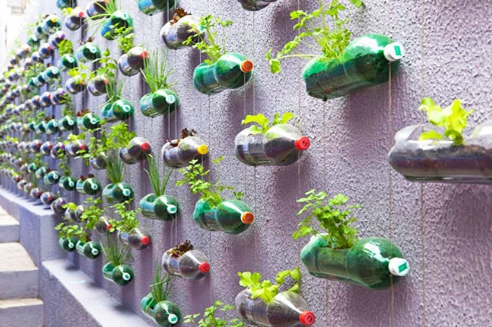
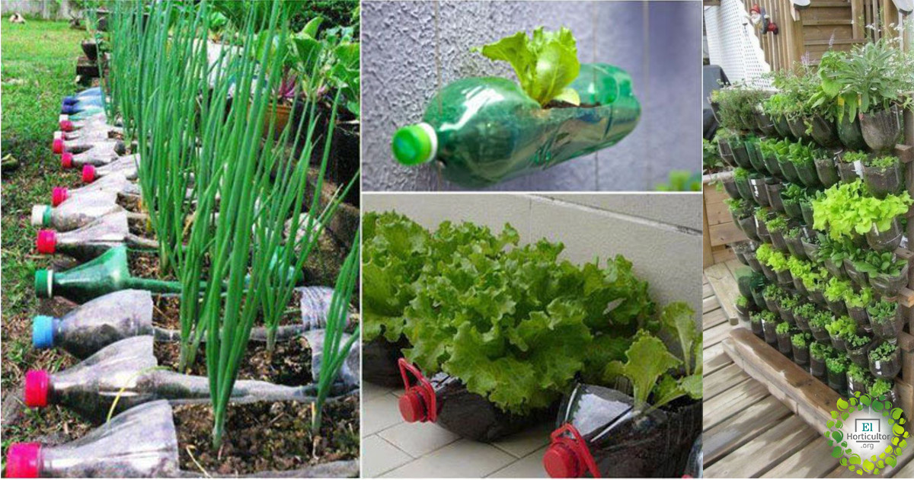
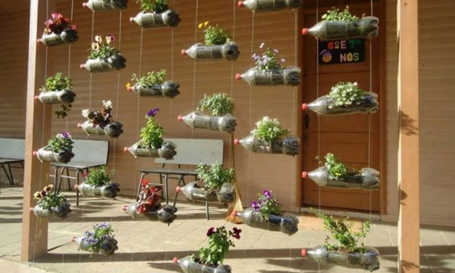
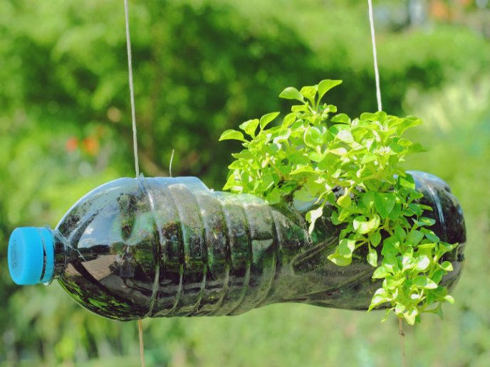
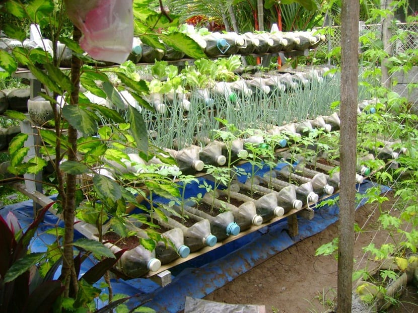

# Plantico
<html>
 <head>
  <link rel="shortcut icon" href="WIN_20210323_12_14_32_Pro.jpg">
 </head>
 <body>
  
<strong>Plantando el mundo</strong>

  
  <pre><code>Queremos acabar con la contaminación y por ello recolectamos
  botellas de plástico quela gente no quiere, las rellenamos con tierra
  fresca y plantaremos bonitas plantas, de esta manera podremos reciclar 
  muchas botellas de plástico, y que haya más oxigeno en la Tierra. </code></pre>

 </body>
 <body>
  <h2> Aquí os pondremos algunos ejemplos de nuestras creaciones: </h2>
  
  
<code>
  En esta imagen hémos plantado césped dentro de unas botellas de plástico que hémos recibido de personas que han querido reciclarlas, así que se fueron   a nuestra empresa y nosotros las reutilizamos de esta manera.
  </code>

  <table>
      <tr>
          <td>😄</td>
      </tr>
  </table>
  

  
    

  
      

  
      

  
      

  
        

  
      

  
      

  
        

  
        

  
      

  
      

  
 </body>
 <body>
       

  <h2> Cómo podemos ayudar a reciclar? </h2>
  <pre><code>
  La mejor forma para ayudarnos a reciclar es trayendo a <strong>Plantico</strong> 
  todas las botellas de plástico que ya no necesites, eso nos ayudaría un montón, no sólo
  a nosotros, sino que también ayudas al medio ambiente. Cada granito de arena cuenta.
  </code></pre>
  <h3> Plantico, sembrando el mundo </h3>
 </body>
<html>
